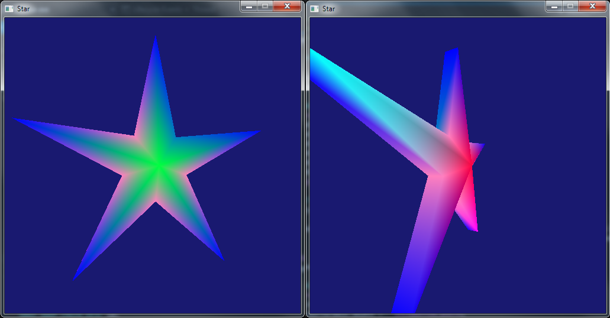

DirectX Projects
================

### 1. Line Land - First contact with DirectX

The first project from the class Direct3D Graphics Programming was a simple one and the lecture walked us through the process to create an empty project and drawing objects using the DirectX11 API.

As shown in the screenshot, we cleared the screen to dark blue color. the grid is composed of black squares (0.1x0.1) - which essentially is an array of triangles. We also created a moving circle that translated by Distance = Velocity * Time.

Quite simple first day project to familiarize with all DirectX elements.

### 2. Spinning Star - Depth/Index Buffers

Getting a 3D star showing up and rendering properly was quite interesting because we used an index buffer; because it’s easier to create and modify complex objects with an index buffer than it is with just a vertex buffer. At the first try we made just a triangle. Finally constructed the full star. Note that to accomplish this we needed tgo generate the two faces separatelly (as noted in the code) and link the faces with a geometry. To do so, we used clock-wise definition for the front face and counter-clock-wise for the back.

### 2.X Shape World - Practice the Learned 

This project was an extension of the second one (spinning star). On this we just needed to create a cube that contained some geometry shapes. We also translated the geometry separately within the cube.

+ Camera Controls: 
	+ A = Move Up
	+ W = Move Down
	+ S = Move Left
	+ D = Move Right
	+ X = Rotate Z to the right
	+ Z = Rotate Z to the left
	+ C = Rotate Y to the right
	+ V = Rotate Y to the left
	+ J = Move Forward
	+ U = Move Backwards

### 3. Cube - Threaded loading

	
This one is rendering a spinning 3D cube with a texture displayed on it. Covered things: Shader Resource Views, a Deferred Context, making a pixel shader to handle textures, and  manipulating matrices to move a camera

+ Controls (same keys as before)

### 4. Grass - Geometry Shader (FIXME - Grass not growing)

### 5. Slime Dungeon - Midterm

This was one of the midterms of the course. We had the entire class session to complete all requirements.

Every element is a quad that is scaled and rotated differently (contact me for this exact information).

+ Undulating the Slime:
The slime is a custom shader that textures the plane with the "DungeonSlime.dds" texture and uses the following formulas in the vertex shader to create the waving effect.
	+ worldVertPosZ += cosine( worldVertPosX + TIME ) * worldVertPosY * 0.1
	+ worldVertPosZ -= cosine( worldVertPosX * 1.25 ) * 0.6 – cosine( TIME * 2 ) * 0.05
	+ worldVertPosX += cosine( worldVertPosY + TIME * 3 ) * worldVertPosX * -0.1

+ No controls

### 6. Chair Scene - Lighting and Model Loading

This project's goals were to implement an object loader and apply some lighting with blending on the scene. 

+ Point Light
The point light is a simple point light positioned at (0, 2, 0,) colored Yellow ( 1, 0.77, 0 ), with a radius of 5. 

+ Spot Light
This is a spot light with an inner and outer radius (the attenuation for which is covered on the attenuation slide). The light’s position is (-4, 3, -4), a cone direction of (1, -1, 1), a light radius of 10, an inner cone ratio of 0.92, an outer cone ratio 0.9, and a color of blue. 

+ Controls (same keys as before)

### 7. Pot Cube - Render to Texture and Viewports

Teapot
+ The teapot is just being drawn at the origin rotating on the Y by time, and the Z by time * 0.75.

+ Directional light
The cube is lit with a directional light that has a direction of (-1, -1, 1). 

+ Controls (same keys as before
+ Controls (same keys as before

## Built With

* [Visual Studio](https://visualstudio.microsoft.com/) 					- For C++ development
* DirectX-11 

## Contributing

Please read [CONTRIBUTING.md](https://github.com/Cabrra/Contributing-template/blob/master/Contributing-template.md) for details on the code of conduct, and the process for submitting pull requests to me.

## Authors

* **Jagoba "Jake" Marcos** - Particle Effect Engineer, Particle Tool, Gluttony, Ambush Ninjas AI, Puzzle Logic, Stealth System - [Cabrra](https://github.com/Cabrra)

## License

This project is licensed under the MIT license - see the [LICENSE](LICENSE) file for details

## Acknowledgments

* Full Sail University - Game Development Department
* Lari Norri - Course director